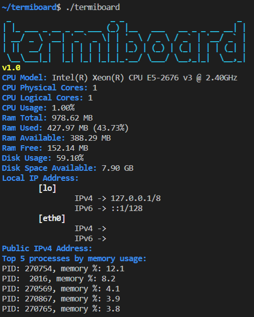
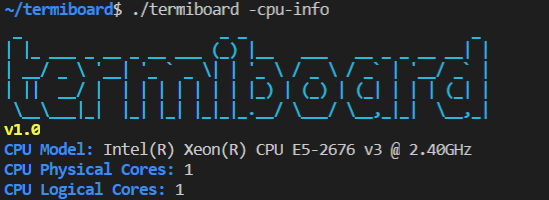

<p align="center"></p>

# Hacktoberfest 2020 with IEEE-VIT :heart:
[](https://github.com/IEEE-VIT/termiboard/)
[](https://github.com/IEEE-VIT/termiboard/blob/master/LICENSE)
[](https://github.com/IEEE-VIT/termiboard/issues/new/choose)
[](https://github.com/IEEE-VIT/termiboard/)
[](https://github.com/IEEE-VIT/termiboard/issues?q=is%3Aopen+is%3Aissue)
[](https://github.com/IEEE-VIT/termiboard/issues?q=is%3Aissue+is%3Aclosed)
[](https://GitHub.com/IEEE-VIT/termiboard/pull/)
[](https://github.com/IEEE-VIT/termiboard)
## Termiboard
The CLI Dashboard to keep a check on your CPU, Memory, and Network!

Support open-source software by participating in [Hacktoberfest](https://hacktoberfest.digitalocean.com) and get goodies and a free t-shirt! :yellow_heart:

> Please check all issues labelled as `hacktoberfest` to start contributing!

Kindly consider leaving a :star: if you like the repository and our organization.

## Getting Started
* Fork it.

* Clone your forked repo and move inside it:

`git clone https://github.com/<your-github-username>/termiboard.git && cd termiboard`

* Checkout to a new branch to work on an issue:

`git checkout -b my-amazing-feature`

* Run termiboard
```console
go run .
```

* Build termiboard
```console
go build
./termiboard
```

* Once you're all done coding, it's time to open a PR :)
Run the following commands from the root of the project directory:

`git add .`

`git commit -m "A short description about the feature."`

`git push origin <my-amazing-feature>`

Open your forked repo in your browser and then raise a PR to the `master` branch of this repository!

## Usage
Once the executable file is created, the program can be executed as:

### Without Flag Options
This will by default show all the parameters of the System.
```console
./termiboard
```
Output:   

### With Flag Options
If the flag options are passed, then the specific parameters of the System will be displayed.
```console
./termiboard --cpu-usage
```
Output:       

#### All Available Options
```console
./termiboard --help
```
| Flag        | Function                                        |
|-------------|-------------------------------------------------|
| --all       | Show all stats                                  |
| --cpu-info  | Show CPU information                            |
| --cpu-usage | Show CPU usage                                  |
| --disk      | Show disk usage                                 |
| --local-ip  | Show local IP address                           |
| --public-ip | Show public IP address                          |
| --ram       | Show RAM usage                                  |
| --top5-ram  | Show top 5 process that consume the most memory |

## Contributing
To start contributing, check out [CONTRIBUTING.md](https://github.com/IEEE-VIT/termiboard/blob/master/CONTRIBUTING.md). New contributors are always welcome to support this project. If you want something gentle to start with, check out issues labelled as `easy` or `good-first-issue`. Check out issues labelled as `hacktoberfest` if you are up for some grabs! :)

## License
This project is licensed under [MIT](https://github.com/IEEE-VIT/termiboard/blob/master/LICENSE).
